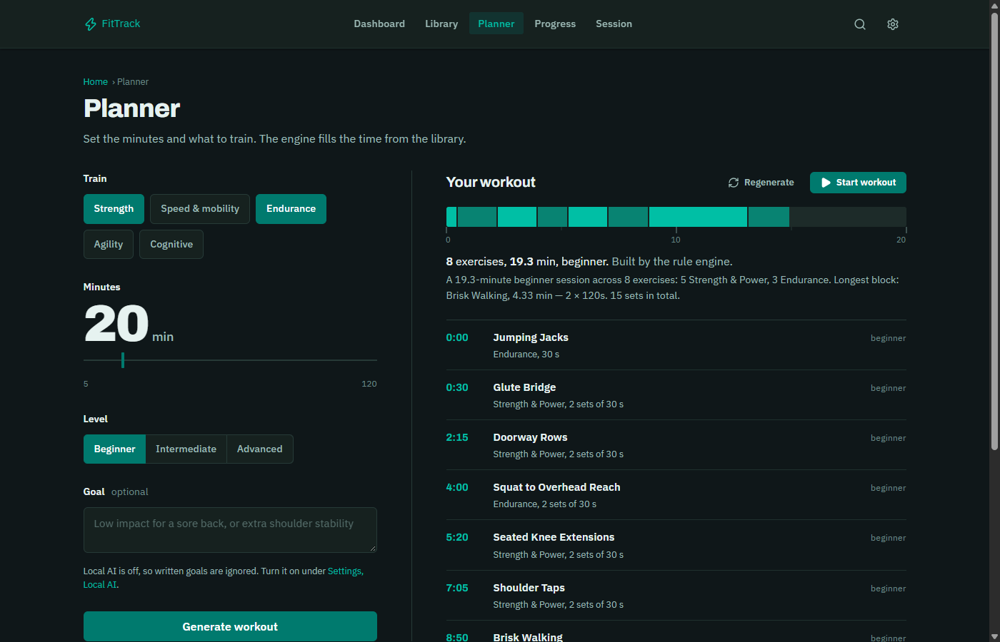

# FitTrack

A workout planner that runs on your own computer. Pick what to train and how
many minutes you have; it builds a timed session from a library of 160+
exercises, runs the timer, and keeps your history.



No account, no cloud, no model required. Everything is stored in one SQLite
file next to the app.

## Install

You need [Python 3.10 or newer](https://www.python.org/downloads/).
On Windows, tick "Add python.exe to PATH" in the installer.

1. **Download** — `git clone https://github.com/Ashiqalink/workout-planner.git`,
   or *Code → Download ZIP* on GitHub and unzip it.
2. **Start** — double-click `run.bat` (Windows), or run `./run.sh` in a
   terminal (macOS, Linux).
3. **Train** — your browser opens at <http://127.0.0.1:5000>. Leave the
   terminal window open while you use the app; close it to stop.

The first start makes a `venv` folder and installs Flask (about a minute).
Later starts take a second.

### Accounts

The download signs you in automatically as a single local user. If several
people share the computer and want separate histories, start it with accounts
turned on:

```bat
set LOCAL_SINGLE_USER=0
run.bat
```
```sh
LOCAL_SINGLE_USER=0 ./run.sh
```

If you already had exactly one account from an older version, single-user mode
opens that account, so your history carries over.

## How workouts are built

**The rules engine does the work.** It filters the library by your domains,
level and equipment, spreads the load across body regions and movement
patterns, avoids what you trained recently, orders the session (power first,
mobility last), and times every set and rest against the minutes you asked
for. It answers in a few milliseconds and needs nothing else installed.

**AI is optional and never in charge.** Two add-ons can be switched on, and
the app behaves the same without both:

- A **local model** (LM Studio) can re-pick exercises from a shortlist the
  engine built, taking a written goal like "go easy on my knees" into
  account, and can understand free-text requests in settings. Every pick is
  checked against the database; everything you read is written by the app.
- The **coaching judge** (TypeSafe) scores each session for order, balance,
  level fit and recovery, and can choose between orderings the engine
  already made.

If either is missing, slow or wrong, you get the engine's plan.

### Optional: connect LM Studio

1. Install [LM Studio](https://lmstudio.ai), download a small instruct model
   (a 1–3B model is plenty) and load it.
2. In LM Studio's *Developer* tab, start the server (it listens on
   `http://localhost:1234`).
3. In FitTrack open **Settings → Local AI**, make sure *Use my local AI model*
   is on, and turn on *Let it build workouts*. A different address or model
   name goes under *Model server address* and *Model name*.

### Optional: add a TypeSafe key

Set the key before starting, then turn on **Settings → Coaching judge →
Score each workout**:

```bat
set TYPESAFE_API_KEY=your-key
run.bat
```
```sh
TYPESAFE_API_KEY=your-key ./run.sh
```

The key stays on your computer's server process; it is never sent to the browser.

## Other settings

Everything is an environment variable read by `config.py`:

| Variable | Default | |
| --- | --- | --- |
| `FLASK_PORT` | `5000` | Change if 5000 is taken |
| `DATABASE_PATH` | `training_app.db` | Your data; back this file up |
| `LOCAL_SINGLE_USER` | `1` | `0` brings back sign-up and login |
| `LM_STUDIO_API_URL` | `http://localhost:1234/v1` | Default model server |
| `TYPESAFE_API_KEY` | unset | Enables the coaching judge |

A secret key for session cookies is made on first run and kept in
`instance/secret_key`. Delete the file to sign everyone out.

To run FitTrack as a website with many accounts, see [DEPLOY.md](DEPLOY.md).

To run the tests: `pip install -r requirements-dev.txt`, then `python -m pytest tests`.

## License

MIT — see [LICENSE](LICENSE).
